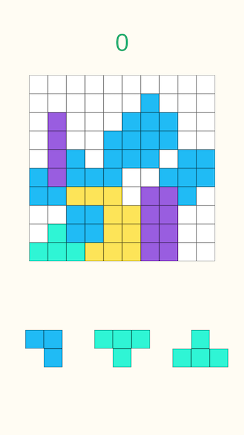
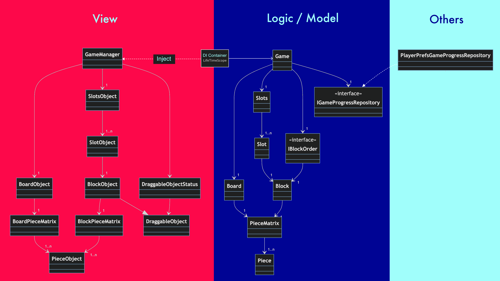
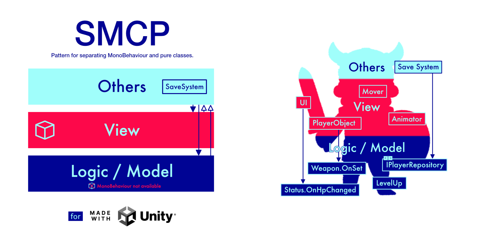
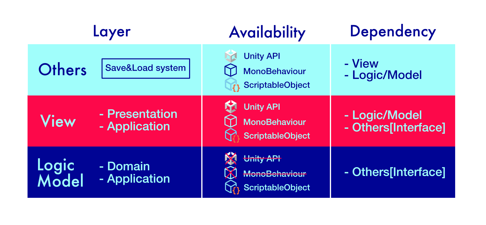

# SMCP x PuzzleGame
This project is a sample project using **SMCP**.

### environment
- Unity : 2022.x
- Screen: 16:9 Portal

### Plug-ins used
- [VContainer](https://github.com/hadashiA/VContainer)

### Class diagram

# What is SMCP?
SMCP is an architecture for separating game logic and data models from MonoBehaviour.
To learn more, please visit this [blog](https://qiita.com/IShix/items/5e1450ad8fb7f4a39f22) (Japanese only).

### Logic/Model Layer
This layer is like a domain or application in onion architecture, such as master data, data model, level-up logic and damage calculation.

#### Prohibited
- ScriptableObjects can be placed, but scripts that inherit from MonoBehaviour cannot be placed.
- Accessing or referencing Unity APIs that can only be obtained during playback (runtime), such as transforms, as arguments for method calls passed from another layer is prohibited.

#### References to the Other Layer
- Only the Other layer can be accessed via interface.

### View Layer
This layer represents and manipulates visible objects such as character manipulation, movement, animation, and UI. In the onion architecture, this layer is like a presentation or application layer.

#### Reference to another layer
- The Logic/Model layer can be accessed.
- The Other layer can also be accessed via interface.

### Other Layer
The only thing that is defined in this layer is the placement of the save system (a function for permanently storing game data).
It may also be a good place to place wrapper classes for external plug-ins that may be replaced later, and it is up to the project how it will be used.

#### Reference to another layer
- All Logic/Model and View layers can be accessed.